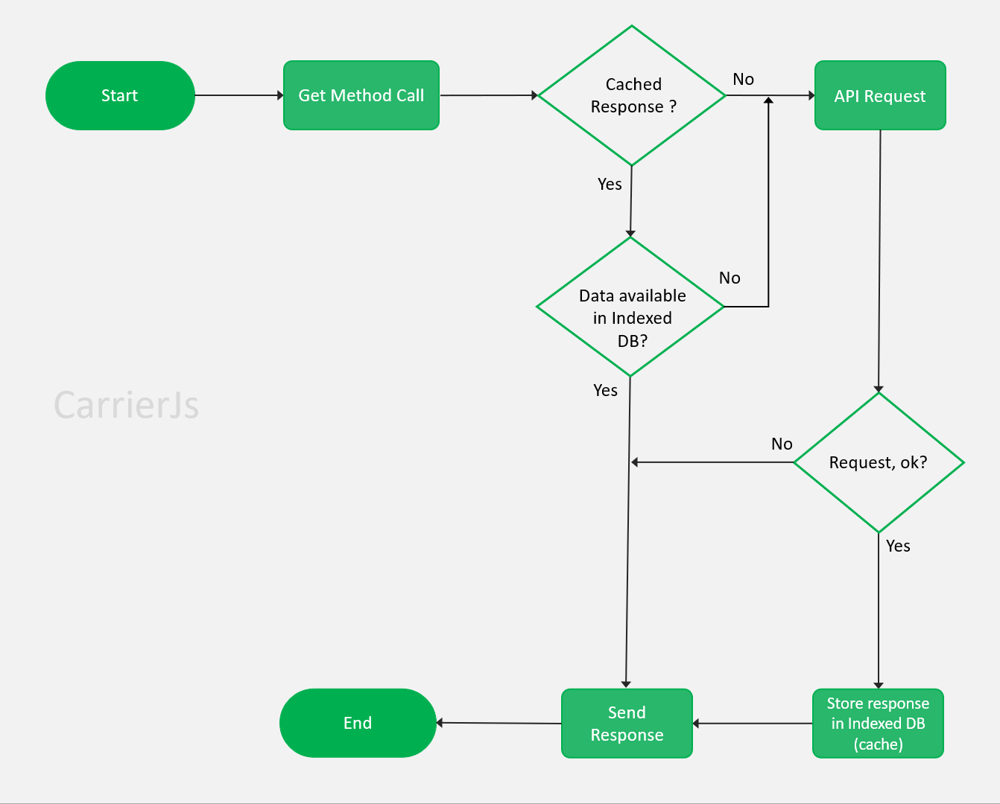

# Carrier JS

> Carrier JS is a **caching** based HTTP client for browsers. It has the ability to store copies of frequently accessed data in several places along the request-response path. It deliver cached responses for common requests and helps to access data  quickly and inexpensively.

[](https://www.npmjs.com/package/carrierjs) [](https://standardjs.com) [](https://www.jsdelivr.com/package/npm/carrierjs) [](https://packagephobia.com/result?p=carrierjs) [](https://twitter.com/carrier_js) [](https://openbase.com/js/carrierjs?utm_source=embedded&amp;utm_medium=badge&amp;utm_campaign=rate-badge)

[](https://nodei.co/npm/carrierjs/)

## Table of Contents

- [Why CarrierJs](#why-carrierjs)
- [How it works internally](#how-it-works-internally)
- [Benefits](#benefits)
- [Features](#features)
- [Browser Support](#browser-support)
- [Installation](#installation)
- [Examples](#examples)
- [Request method aliases](#request-method-aliases)
- [Set Request Headers](#set-request-headers)
- [Response Object](#response-object)
- [Handling Errors](#handling-errors)
- [Contribution](#contribution)
- [License](#license)

## Why CarrierJs

Duplicate API requests are common and if dealt wisely, can help developers in creating a seamless user experience. In a scalable application, duplicate API requests can be problematic to the resources on a server, can affect the cost, and can interrupt performance.

That is why it is important to pay attention to API calls and ensure that no duplicate request is passed to the API server.

**Possible Reasons for duplicate API requests -**

There can be different scenarios where an API is called multiple times to get the data. For example,

- When a user taps on a button multiple times before it gets disabled.

- At times, one API response causes another API request to execute. Let's understand this with an analogy. There are several books with the same author details. As the details of the book get loaded, another requests to load the author's details is passed consequently. In this scenario, the request for multiple book details can hit the author's details API (while one is already under execution).

- API requests on scroll events can hit an API multiple times as the scroll event triggers rapidly.


To prevent from the duplicate API requests, **CarrierJs** comes into the picture 👇.

## How it works internally

First, it checks to see whether data exists in the cache. If it exists, it returns data from the cache as a response. If it doesn't exist then it read data from the API server.

Then it writes to the cache and returns the data as response. The subsequent requests will be served through the cache.

If you want fresh data everytime from the API server, you can pass an extra parameter called `refresh` with value `true` after the API server url.

This diagram shows how carrierjs internally fulfills the request with its ultimate caching feature.



## Benefits

There are several benefits of caching your API's response. Here are some of them:

- Your quality of service improves.
- The website consumes less bandwidth.
- The website latency decreases.
- Server load also decreases.

## Features

- Make **XMLHttpRequest** from browser
- Supports **All Browsers**
- Enable IndexedDB Based Caching which can store **250MB** of data
- Data will not expire unless explicit deletion of the database **(persistent storage)**
- It decreases server round trips for fetching data from the database by persisting data in the memory.

## Browser Support

| Chrome | Edge | Firefox | Opera | Safari |
| ------ | ---- | ------- | ----- | ------ |
| ✅     | ✅   | ✅      | ✅    | ✅     |

## Installation

### Using NPM

```bash
npm install --save carrierjs
```

### Using cdnjs

```bash
<script src="https://cdnjs.cloudflare.com/ajax/libs/carrierjs/2.3.0/carrier.js">
```

### Using jsDelivr

```bash
<script src="https://cdn.jsdelivr.net/npm/carrierjs@latest/carrier.js">
```

### Using unpkg

```bash
<script src="https://unpkg.com/carrierjs@latest/carrier.js">
```

## Examples

**Performing a GET request:**

```jsx

// Using Promise
carrier.get('https://jsonplaceholder.typicode.com/todos/').then((result) => {
    console.log(result)
}).catch((err) => {
    console.log(err)
});

---------

// Using Async/Await
async function getUser() {
  try {
    const response = await carrier.get('https://jsonplaceholder.typicode.com/todos/')
    console.log(response);
  } catch (error) {
    console.error(error);
  }
}

getUser();
```

**Performing a POST request:**

```jsx
const data = {
    title: "delectus aut autem",
    completed: false
}

// Using Promise
carrier.post('https://jsonplaceholder.typicode.com/todos', data).then((result) => {
    console.log(result)
}).catch((err) => {
    console.log(err)
});

---------

// Using Async/Await
async function createUser(data) {
  try {
    const response = await carrier.post('https://jsonplaceholder.typicode.com/todos', data)
    console.log(response);
  } catch (error) {
    console.error(error);
  }
}

createUser(data);
```

**Performing a PUT request:**

```jsx
const data = {
    title: "delectus aut autem",
    completed: false
}

// Using Promise
carrier.put('https://jsonplaceholder.typicode.com/todos/5', data).then((result) => {
    console.log(result)
}).catch((err) => {
    console.log(err)
});

---------

// Using Async/Await
async function updateUser(data) {
  try {
    const response = await carrier.put('https://jsonplaceholder.typicode.com/todos/5', data)
    console.log(response);
  } catch (error) {
    console.error(error);
  }
}

updateUser(data);
```

**Performing a DELETE request:**

```jsx

// Using Promise
carrier.delete('https://jsonplaceholder.typicode.com/todos/5').then((result) => {
    console.log(result)
}).catch((err) => {
    console.log(err)
});

---------

// Using Async/Await
async function deleteUser(data) {
  try {
    const response = await carrier.delete('https://jsonplaceholder.typicode.com/todos/')
    console.log(response);
  } catch (error) {
    console.error(error);
  }
}

deleteUser(data);
```

## Request method aliases

For your ease, aliases have been provided for request methods.

**carrier.get(url, [refresh])**

**carrier.post(url, [data])**

**carrier.put(url, [data])**

**carrier.delete(url, [data])**

**Note -** While using this methods, `url` is required and `data` is optional. `refresh` is by default `false`. If you want to get fresh data everytime from the server, you need to send `true` after `url` parameter.

## Set Request Headers

Let's see how we can use it to add request headers to an HTTP request.

Now, there are multiple ways to set request headers. The most common way is to use the ```headers``` property of the ```carrier``` object like this:

```js
import carrier from 'carrierjs';

const fetchTodos = async () => {
	const result = await carrier.get(
		'https://jsonplaceholder.typicode.com/todos/',
        true,
		{
			headers: {
				'header_1': 'value_1',
				'header_2': 'value_2'
			}
		}
	);
	return result.response;
};
```

You can also add these headers using a ```config``` object for a cleaner code.

```js
import carrier from 'carrierjs';

const fetchTodos = async () => {
	const config = {
		headers: {
			'header_1': 'value_1',
            'header_2': 'value_2'
		}
	};
	const result = await carrier.get(
		'https://jsonplaceholder.typicode.com/todos/',
		config
	);
	return result.response;
};

```

**⚠️ Headers limitations**

Several headers are managed exclusively by the browser, e.g. `Referer` and `Host`. The full list is in the [specification](https://xhr.spec.whatwg.org/#the-setrequestheader()-method).

`carrier` not allowed to change them, for the sake of user safety and correctness of the request.

**⚠️ Can’t remove a header**

Another peculiarity of `carrier` is that one can’t undo `headers`.

Once the header is set, it’s set. Additional calls add information to the header, don’t overwrite it.

For instance:

```js
const config = {
    headers: {
        'header_1': 'value_1',
        'header_1': 'value_2'
    }
};

// the header will be:
// header_1: value_1, value_2
```

## Response Object

The response for a request contains the following information.

```js
{
  // `response` is the response that was provided by the server
  response: {},

  // `status` is the HTTP status code from the server response
  status: statusCode,

  // `type` is the type of response recieved from the server eg. json, script
  type: '',

  // `headers` the HTTP headers that the server responded with headers
  headers: {},

  // `request` is the request that generated this response
  request: {}

  // `url` is the url to that request is generated
  url: {}
}
```

## Contribution

**Note** - Give a ⭐ to this project

- Fork this repository (Click the Fork button in the top right of this page, click your Profile Image)
- Clone your fork down to your local machine

```bash
git clone https://github.com/your-username/carrierjs.git
```

- Create a branch

```bash
git checkout -b branch-name
```

- Make your changes (choose from any task below)
- Commit and push

```bash
git add .
git commit -m 'Commit message'
git push origin branch-name
```

- Create a new pull request from your forked repository (Click the New Pull Request button located at the top of your repo)
- Wait for your PR review and merge approval!
- Star this repository if you had fun!

For more information, Please read [CONTRIBUTING.md](https://github.com/theritikchoure/carrierjs/blob/master/CONTRIBUTING.md) for details on our code of conduct, and the process for submitting pull requests to us.

## License

This package is licensed under the MIT license &copy; [theritikchoure](https://github.com/theritikchoure)

## Thanks to all Contributors

<a href="https://github.com/theritikchoure/carrierjs/graphs/contributors">
  
</a>
